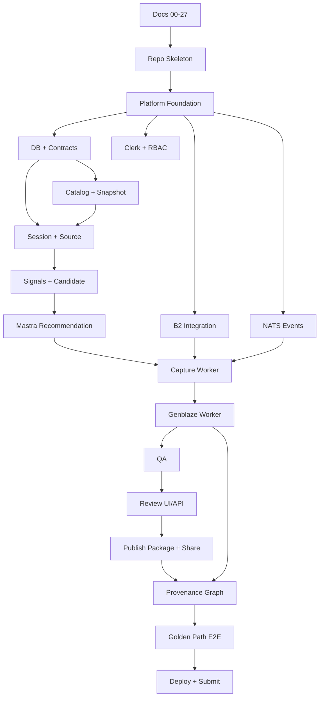

# 27 — Implementation Plan & Task Breakdown

**Project:** Lumiq — Live Commerce Moment Vault  
**Document ID:** `27-implementation-plan-tasks.md`  
**Status:** Draft v1  
**Audience:** founders, engineering leads, backend engineers, frontend engineers, AI engineers, media engineers, QA, infra/devops, designers, AI coding agents  
**Depends on:** all official spec-kit documents `00` through `26`

---

## 1. Purpose

This document turns the Lumiq specification kit into an ordered implementation plan.

It defines:

```txt
implementation phases
critical path
parallel workstreams
task IDs
dependencies
owners
requirement mappings
definition of done
test gates
handoff rules for humans and AI coding agents
```

The plan is production-minded, but the first execution target is the hackathon golden path.

Core implementation rule:

```txt
Build the smallest real end-to-end vertical slice first: seeded setup → prerecorded-live session → candidate detection → Mastra recommendation → policy capture → B2 raw asset → Genblaze generation → QA → review approval → publish package/share page → provenance graph.
```

---

## 2. Planning Principles

### 2.1 Specs lead, code follows

No implementation task should invent behavior that is not specified. If a behavior is missing, update the relevant spec or mark the task exploratory.

### 2.2 Vertical slice before breadth

Do not build every screen, provider, adapter, or admin flow before the golden path works.

Priority order:

```txt
P0 golden path
P0 safety/provenance gates
P0 demo reliability
P1 production beta hardening
P2/P3 integrations and enterprise scale
```

### 2.3 Agents are not executors

Implementation must preserve:

```txt
Mastra recommends.
Core API authorizes.
NATS dispatches.
Workers execute.
Genblaze generates media.
B2 stores proof.
Postgres tracks truth.
```

### 2.4 Every expensive or sensitive side effect needs a gate

Side effects include:

```txt
B2 writes
generation/provider calls
LLM calls
state transitions
publish package creation
share page creation
delete/revoke actions
budget overrides
admin recovery
```

### 2.5 Test gates are part of task completion

A task is not done if it lacks relevant tests or manual acceptance criteria.

---

# 3. Implementation Phases

```yaml
phases:
  phase_0_spec_and_repo_alignment:
    priority: P0
    goal: make_repo_match_spec_kit_and_prepare_coding_agents
  phase_1_platform_foundation:
    priority: P0
    goal: auth_db_events_storage_service_skeletons
  phase_2_contracts_and_data_model:
    priority: P0
    goal: migrations_schemas_api_events_and_validation
  phase_3_golden_path_backend:
    priority: P0
    goal: session_detection_capture_generation_qa_publish_provenance
  phase_4_golden_path_frontend:
    priority: P0
    goal: setup_live_studio_review_vault_provenance_share
  phase_5_testing_observability_and_recovery:
    priority: P0_P1
    goal: protect_demo_path_and_recover_failures
  phase_6_deployment_and_submission:
    priority: P0
    goal: deploy_seed_record_submit
  phase_7_production_beta_hardening:
    priority: P1
    goal: turn_hackathon_slice_into_beta
  phase_8_integrations_and_enterprise:
    priority: P2_P3
    goal: commerce_publish_adapters_enterprise_controls
```

---

# 4. Critical Path

The critical path is the minimum implementation sequence that produces the hackathon demo.

```txt
1. Repo + environment skeleton
2. Design tokens + app shell
3. Clerk auth + internal org/user/membership model
4. Neon schema migrations for P0 tables
5. Core API command/query skeleton
6. B2 bucket/key/signed URL integration
7. NATS streams + event envelope
8. Seeded product/campaign/catalog snapshot
9. Session create/start/end + prerecorded source
10. Signal/candidate event generation
11. Mastra supervisor recommendation fixture or live structured output
12. Moment policy capture authorization
13. Capture Worker writes raw source/mezzanine to B2
14. Generation Service creates generation_run
15. Genblaze Worker executes template or labeled fallback
16. Enhanced asset + manifest + provenance links written
17. QA Worker writes post-enhancement QA
18. Review Queue shows moment
19. Reviewer approves canonical version
20. Publish package/share page created
21. Provenance graph shows raw → Genblaze run → enhanced → publish
22. Golden path E2E smoke test passes
23. Demo video recorded
```

---

# 5. Workstream Ownership

```yaml
workstreams:
  product_demo:
    owns:
      - demo_scenario
      - seeded_data
      - demo_video_script
      - judge_story
  frontend:
    owns:
      - design_system_application
      - app_shell
      - setup_ui
      - live_studio
      - review_queue
      - provenance_ui
      - share_page
  backend_core:
    owns:
      - authz
      - state_machines
      - api_commands
      - budget_policy
      - audit
      - signed_urls
  data_contracts:
    owns:
      - migrations
      - JSON_schemas
      - OpenAPI_sync
      - AsyncAPI_sync
      - contract_tests
  ai_agents:
    owns:
      - Mastra_agents
      - tool_gateway_client
      - structured_outputs
      - LLMProviderRouter
      - prompt_injection_guardrails
  media_pipeline:
    owns:
      - capture_worker
      - template_step_graph
      - Genblaze_worker
      - renderer
      - manifest_writer
  storage_provenance:
    owns:
      - B2_buckets
      - object_keys
      - checksums
      - manifest_records
      - provenance_graph
  qa_safety:
    owns:
      - QA_checks
      - moderation_policy
      - product_claim_validation
      - AI_eval_fixtures
  infra_devops:
    owns:
      - Docker
      - NATS
      - Neon
      - Clerk_envs
      - secrets
      - CI_CD
      - deployment
  operations:
    owns:
      - admin_recovery
      - DLQ
      - reconciliation
      - runbooks
```

---

# 6. Definition of Done by Artifact Type

## 6.1 Backend command/API task

A backend command task is done when:

```txt
API or internal endpoint exists.
Auth/authz checks are implemented.
Organization scope is enforced.
Input schema is validated.
Idempotency key is accepted/enforced.
State-machine guard exists where relevant.
Audit event is written for sensitive action.
Unit and integration tests pass.
OpenAPI is updated if public/internal HTTP contract changed.
```

## 6.2 Event/worker task

A worker task is done when:

```txt
AsyncAPI event contract exists or is updated.
Consumer validates event envelope and payload.
Consumer is idempotent.
Worker reports state through Core API.
Worker ACKs only after durable state.
Retry and DLQ behavior is tested.
Duplicate event test passes.
```

## 6.3 Media pipeline task

A media task is done when:

```txt
Input asset contract is defined.
Output asset role is defined.
B2 object key convention is used.
SHA-256 is calculated.
Generation_run or asset row is linked.
Manifest is written and schema-validated.
QA gate is triggered.
Rerender does not overwrite previous output.
```

## 6.4 Agent task

An agent task is done when:

```txt
Agent role is documented.
Tools are narrow and gateway-only.
Structured output schema exists.
LLMProviderRouter is used.
Malformed output is rejected.
Prompt-injection fixture is tested.
Agent cannot call forbidden side effects.
agent_tool_call and llm_run records are written where applicable.
```

## 6.5 Frontend task

A frontend task is done when:

```txt
Uses Lumiq design tokens.
Supports empty/loading/error/blocked states.
Hides unauthorized controls.
Backend still enforces authorization.
Shows provenance where relevant.
Supports reduced-motion where animation exists.
Playwright or component test covers main interaction.
```

## 6.6 Demo task

A demo task is done when:

```txt
It works from a clean seed.
It can be rerun idempotently.
It does not require hidden manual database edits.
It has a fallback path.
It is represented in the demo script.
```

---

# 7. Phase 0 — Spec and Repo Alignment

## Goal

Make the repository safe for humans and AI coding agents to implement.

```yaml
phase_0:
  priority: P0
  exit_criteria:
    - specs_are_placed_in_expected_directories
    - README_points_to_spec_index
    - coding_agent_rules_are_visible
    - local_bootstrap_command_exists
```

## Tasks

| Task ID | Task | Owner | Depends on | Requirement refs | DoD / Test gate |
|---|---|---|---|---|---|
| TASK-SPEC-001 | Place docs `00`–`27` in canonical repo structure | Product/Architecture | none | RULE-SOT-001 | Files present under `/docs`; links in index work |
| TASK-SPEC-002 | Add `README.md` with project overview and reading order | Product/Engineering | TASK-SPEC-001 | RULE-SOT-001 | README references spec index and golden path |
| TASK-SPEC-003 | Add `AGENTS.md` for coding-agent rules | Architecture | TASK-SPEC-001 | RULE-SOT-001, RULE-AGENT-001 | File lists do/don't rules and required reading order |
| TASK-SPEC-004 | Add repo folder skeleton | Engineering | TASK-SPEC-001 | N/A | `/apps/web`, `/apps/api`, `/apps/mastra`, `/workers`, `/packages`, `/docs` exist |
| TASK-SPEC-005 | Add requirement-to-test traceability convention | QA | TASK-SPEC-001 | RULE-TEST-001 | Test naming or metadata convention documented |

---

# 8. Phase 1 — Platform Foundation

## Goal

Create a runnable local foundation: app shell, API, database, event backbone, B2 integration, service identities.

```yaml
phase_1:
  priority: P0
  exit_criteria:
    - local_stack_runs
    - web_can_call_api
    - api_can_connect_db
    - api_can_publish_nats_event
    - api_can_create_signed_b2_url_or_worker_can_write_b2
    - Clerk_auth_or_dev_auth_adapter_works
```

## Tasks

| Task ID | Task | Owner | Depends on | Requirement refs | DoD / Test gate |
|---|---|---|---|---|---|
| TASK-FOUND-001 | Initialize monorepo package manager and lint/typecheck | Engineering | TASK-SPEC-004 | RULE-ENV-004 | `pnpm lint`, `pnpm typecheck` or equivalents pass |
| TASK-FOUND-002 | Create Docker Compose local stack | Infra | TASK-FOUND-001 | RULE-ENV-002 | Starts API, workers, NATS, local DB or Neon branch config |
| TASK-FOUND-003 | Create Next.js app shell using Lumiq tokens | Frontend | TASK-FOUND-001 | REQ-UI-001, REQ-UI-003 | Dark-only shell renders; no arbitrary colors |
| TASK-FOUND-004 | Create Core API skeleton | Backend | TASK-FOUND-001 | RULE-ARCH-002 | `/healthz` works; structured logging enabled |
| TASK-FOUND-005 | Implement Clerk/dev auth adapter | Backend | TASK-FOUND-004 | REQ-AUTH-001 | Authenticated user maps to internal user in dev/staging |
| TASK-FOUND-006 | Implement internal authorization service skeleton | Backend | TASK-FOUND-005 | REQ-AUTH-002, REQ-AUTH-003 | Capability denial test passes |
| TASK-FOUND-007 | Create service identity token/auth mechanism | Backend/Security | TASK-FOUND-004 | REQ-AUTH-004 | Worker without service token denied |
| TASK-FOUND-008 | Configure NATS connection and streams | Infra/Backend | TASK-FOUND-004 | REQ-EVENT-003 | API publishes test event; consumer receives |
| TASK-FOUND-009 | Configure B2 client and environment buckets | Storage/Infra | TASK-FOUND-004 | REQ-ASSET-001 | Worker can write/read a test object in dev/staging bucket |
| TASK-FOUND-010 | Add base audit logger | Backend | TASK-FOUND-004 | REQ-AUDIT-001 | Audit write helper tested |

---

# 9. Phase 2 — Contracts and Data Model

## Goal

Implement migrations and validation contracts for the P0 golden path.

```yaml
phase_2:
  priority: P0
  exit_criteria:
    - P0_tables_migrated
    - seed_org_user_product_campaign_session_possible
    - OpenAPI_and_AsyncAPI_contract_tests_run
    - JSON_schema_validation_available_in_TS_and_Python
```

## P0 database tables

Implement at minimum:

```txt
users
organizations
memberships
role_capabilities
service_identities
service_capabilities
products
campaigns
campaign_offers
allowed_product_claims
catalog_snapshots
catalog_snapshot_products
catalog_snapshot_offers
catalog_snapshot_claims
sessions
session_sources
moments
signals
moment_evidence
moment_policy_decisions
assets
generation_runs
provenance_links
manifest_records
enhancement_templates
template_versions
step_graphs
qa_checks
review_actions
publish_packages
publish_variants
share_pages
agent_tool_calls
llm_runs
audit_events
system_events
outbox_events or direct_event_log
dead_letter_events
budgets
budget_authorizations
cost_ledger
```

## Tasks

| Task ID | Task | Owner | Depends on | Requirement refs | DoD / Test gate |
|---|---|---|---|---|---|
| TASK-DATA-001 | Implement ULID helper and timestamp conventions | Backend | TASK-FOUND-004 | glossary ID rules | Unit tests pass |
| TASK-DATA-002 | Create auth/org/membership migrations | Backend | TASK-DATA-001 | REQ-AUTH-002 | Migration applies/rolls back in dev |
| TASK-DATA-003 | Create catalog/campaign/snapshot migrations | Backend | TASK-DATA-001 | REQ-CATALOG-001, REQ-CATALOG-003 | Seed product/campaign test passes |
| TASK-DATA-004 | Create session/moment/signal migrations | Backend | TASK-DATA-001 | REQ-SESSION-001, REQ-SIGNAL-002 | State enum constraints tested |
| TASK-DATA-005 | Create asset/generation/provenance migrations | Backend/Storage | TASK-DATA-001 | REQ-ASSET-001, REQ-PROV-001 | FK/link tests pass |
| TASK-DATA-006 | Create QA/review/publish/share migrations | Backend | TASK-DATA-001 | REQ-QA-002, REQ-PUBLISH-001 | Publish package FK tests pass |
| TASK-DATA-007 | Create agent/LLM/audit/event/cost migrations | Backend/AI | TASK-DATA-001 | REQ-AGENT-004, REQ-LLM-003, REQ-AUDIT-001 | Records insert with org scope |
| TASK-DATA-008 | Add JSON Schema validation package | Backend/QA | TASK-DATA-005 | 11-json-schemas | Schema validation tests pass |
| TASK-DATA-009 | Add OpenAPI contract validation to CI | Backend/QA | TASK-FOUND-004 | 09-api-contract | OpenAPI lint passes |
| TASK-DATA-010 | Add AsyncAPI contract validation to CI | Backend/QA | TASK-FOUND-008 | 10-event-contract | AsyncAPI lint passes |

---

# 10. Phase 3 — Golden Path Backend

## Goal

Make the full backend media workflow real enough for the demo.

```yaml
phase_3:
  priority: P0
  exit_criteria:
    - seeded_session_can_detect_candidate
    - raw_capture_asset_written_to_B2
    - generation_run_creates_enhanced_asset
    - QA_passes_or_blocks
    - publish_package_created
    - provenance_graph_query_returns_lineage
```

## Tasks

### 10.1 Catalog and setup

| Task ID | Task | Owner | Depends on | Requirement refs | DoD / Test gate |
|---|---|---|---|---|---|
| TASK-BE-SETUP-001 | Implement organization setup-status API | Backend | TASK-DATA-002 | REQ-UI-001 | API returns checklist |
| TASK-BE-CATALOG-001 | Implement create/list product APIs | Backend | TASK-DATA-003 | REQ-CATALOG-001 | API tests pass |
| TASK-BE-CATALOG-002 | Implement campaign create/list APIs | Backend | TASK-DATA-003 | REQ-CATALOG-001 | API tests pass |
| TASK-BE-CATALOG-003 | Implement allowed claims validation | Backend/QA | TASK-DATA-003 | REQ-CATALOG-005 | Ungrounded claim rejected |
| TASK-BE-CATALOG-004 | Implement catalog snapshot creation and B2 manifest write | Backend/Storage | TASK-BE-CATALOG-001 | REQ-CATALOG-003, REQ-CATALOG-004 | Postgres rows + B2 manifest exist |
| TASK-BE-CATALOG-005 | Add seeded demo catalog/campaign script | Product/Backend | TASK-BE-CATALOG-004 | DEMO-AC-004 | Re-runnable seed test passes |

### 10.2 Session and detection

| Task ID | Task | Owner | Depends on | Requirement refs | DoD / Test gate |
|---|---|---|---|---|---|
| TASK-BE-SESSION-001 | Implement session create/start/end APIs | Backend | TASK-DATA-004 | REQ-SESSION-001, REQ-SESSION-004, REQ-SESSION-005 | State transition tests pass |
| TASK-BE-SESSION-002 | Implement prerecorded-live source refs | Backend/Frontend | TASK-BE-SESSION-001 | REQ-SESSION-002 | Source can be attached to session |
| TASK-BE-SIGNAL-001 | Implement seeded signal emitter for demo source | Backend/Worker | TASK-BE-SESSION-002 | REQ-SIGNAL-001 | Signal events inserted/emitted by timecode |
| TASK-BE-SIGNAL-002 | Implement candidate proposal logic | Backend/Worker | TASK-BE-SIGNAL-001 | REQ-SIGNAL-002 | Candidate emitted for product reveal |
| TASK-BE-SIGNAL-003 | Implement duplicate window suppression | Backend | TASK-BE-SIGNAL-002 | REQ-SIGNAL-005 | Duplicate candidate test passes |

### 10.3 Mastra agent path

| Task ID | Task | Owner | Depends on | Requirement refs | DoD / Test gate |
|---|---|---|---|---|---|
| TASK-AI-001 | Create Mastra app skeleton | AI | TASK-FOUND-001 | REQ-AGENT-001 | Agent service starts |
| TASK-AI-002 | Implement LLMProviderRouter minimal OpenAI route | AI | TASK-AI-001 | REQ-LLM-001, REQ-LLM-002 | Router unit test passes |
| TASK-AI-003 | Implement supervisor-agent-v1 structured output | AI | TASK-AI-002 | REQ-AGENT-001, REQ-SIGNAL-003 | Schema-valid recommendation returned |
| TASK-AI-004 | Implement agent tool gateway client | AI/Backend | TASK-AI-003, TASK-DATA-007 | REQ-AGENT-003, REQ-AGENT-004 | Tool call record written |
| TASK-AI-005 | Add deterministic fixture mode for demo | AI/QA | TASK-AI-003 | REQ-AGENT-005 | Fixture output clearly marked in config |
| TASK-AI-006 | Add prompt injection eval fixtures | AI/Security | TASK-AI-004 | 20-ai-security-safety-spec | Unsafe tool request denied |

### 10.4 Capture

| Task ID | Task | Owner | Depends on | Requirement refs | DoD / Test gate |
|---|---|---|---|---|---|
| TASK-BE-MOMENT-001 | Implement capture policy service | Backend | TASK-BE-SIGNAL-002 | REQ-CAPTURE-001, REQ-CAPTURE-002 | Budget/duplicate/session checks tested |
| TASK-BE-MOMENT-002 | Emit `moment.capture.authorized` | Backend | TASK-BE-MOMENT-001, TASK-FOUND-008 | REQ-EVENT-001, REQ-CAPTURE-001 | AsyncAPI schema validates |
| TASK-WORKER-CAPTURE-001 | Implement Capture Worker consumer | Media/Worker | TASK-BE-MOMENT-002 | REQ-CAPTURE-004 | Consumes event idempotently |
| TASK-WORKER-CAPTURE-002 | Implement raw source extraction from demo source | Media/Worker | TASK-WORKER-CAPTURE-001 | REQ-CAPTURE-003 | Raw capture window file created |
| TASK-WORKER-CAPTURE-003 | Upload raw source to B2 and create asset record | Media/Storage | TASK-WORKER-CAPTURE-002, TASK-FOUND-009 | REQ-ASSET-001, REQ-ASSET-004 | B2 object + sha256 + asset row exist |
| TASK-WORKER-CAPTURE-004 | Create raw mezzanine asset | Media/Worker | TASK-WORKER-CAPTURE-003 | REQ-CAPTURE-005 | Mezzanine exists or failure recorded |

### 10.5 Generation and Genblaze

| Task ID | Task | Owner | Depends on | Requirement refs | DoD / Test gate |
|---|---|---|---|---|---|
| TASK-TEMPLATE-001 | Seed `clean_product_reveal` template v1 | Media/Backend | TASK-DATA-005 | REQ-TEMPLATE-001 | Template validates against step registry |
| TASK-TEMPLATE-002 | Implement safe step registry minimal P0 | Media/Backend | TASK-TEMPLATE-001 | REQ-TEMPLATE-002, REQ-TEMPLATE-003 | Unknown step rejected |
| TASK-BE-GEN-001 | Implement generation request service | Backend | TASK-WORKER-CAPTURE-003, TASK-TEMPLATE-001 | REQ-GEN-001, REQ-COST-001 | generation_run queued + event emitted |
| TASK-WORKER-GEN-001 | Implement Genblaze Worker consumer | Media/Worker | TASK-BE-GEN-001 | REQ-GEN-001 | Duplicate event does not duplicate output |
| TASK-WORKER-GEN-002 | Implement minimal Genblaze/template execution path | Media/Worker | TASK-WORKER-GEN-001 | REQ-GEN-002 | Enhanced asset generated or labeled fallback used |
| TASK-WORKER-GEN-003 | Write Genblaze/app provenance manifests to B2 | Media/Storage | TASK-WORKER-GEN-002 | REQ-PROV-001, REQ-PROV-003 | Manifest schema validates |
| TASK-WORKER-GEN-004 | Report generation completed/failed to Core API | Media/Backend | TASK-WORKER-GEN-003 | REQ-GEN-003, REQ-GEN-004 | State transition tests pass |
| TASK-WORKER-GEN-005 | Implement rerender new-version behavior | Backend/Media | TASK-WORKER-GEN-004 | REQ-GEN-005 | Rerender creates new asset key |

### 10.6 QA, review, publish, provenance

| Task ID | Task | Owner | Depends on | Requirement refs | DoD / Test gate |
|---|---|---|---|---|---|
| TASK-QA-001 | Implement post-enhancement QA minimal checks | QA/Backend | TASK-WORKER-GEN-004 | REQ-QA-002, REQ-QA-004 | QA passed/review_required states work |
| TASK-QA-002 | Implement product fact QA | QA/Commerce | TASK-BE-CATALOG-003, TASK-QA-001 | REQ-QA-005, REQ-CATALOG-005 | Ungrounded claim blocks publish |
| TASK-REVIEW-001 | Implement review queue query | Backend | TASK-QA-001 | REQ-REVIEW-001 | Review pending item returned |
| TASK-REVIEW-002 | Implement approve/reject/promote canonical APIs | Backend | TASK-REVIEW-001 | REQ-REVIEW-005 | Audit + state transition tests pass |
| TASK-PUBLISH-001 | Implement publish package creation | Backend/Worker | TASK-REVIEW-002 | REQ-PUBLISH-001 | Package contains media/thumb/captions/provenance ref |
| TASK-PUBLISH-002 | Implement share page creation | Backend/Frontend | TASK-PUBLISH-001 | REQ-PUBLISH-004 | Share slug resolves |
| TASK-PROV-001 | Implement provenance graph query | Backend/Storage | TASK-WORKER-GEN-003, TASK-PUBLISH-001 | REQ-PROV-002, REQ-PROV-004 | Graph includes raw, run, enhanced, publish nodes |

---

# 11. Phase 4 — Golden Path Frontend

## Goal

Build the screens required to demonstrate the full workflow.

```yaml
phase_4:
  priority: P0
  exit_criteria:
    - seeded_setup_visible
    - Live_Studio_shows_detection_progress
    - Review_Queue_supports_compare_and_approve
    - Provenance_UI_shows_lineage
    - Share_Page_renders_publish_package
```

## Tasks

| Task ID | Task | Owner | Depends on | Requirement refs | DoD / Test gate |
|---|---|---|---|---|---|
| TASK-FE-001 | Implement authenticated app shell/sidebar/topbar | Frontend | TASK-FOUND-003, TASK-FOUND-005 | REQ-UI-001 | Role-based nav smoke test |
| TASK-FE-002 | Implement setup/demo workspace screen | Frontend | TASK-BE-SETUP-001, TASK-BE-CATALOG-005 | 05-user-flows | Seeded setup visible |
| TASK-FE-003 | Implement catalog/campaign summary cards | Frontend | TASK-BE-CATALOG-001 | REQ-CATALOG-001 | Product/claim data renders |
| TASK-FE-004 | Implement Live Studio preflight | Frontend | TASK-BE-SESSION-001 | REQ-SESSION-002 | Start demo session works |
| TASK-FE-005 | Implement Live Studio control room | Frontend | TASK-BE-SESSION-002, TASK-BE-SIGNAL-001 | REQ-REVIEW-002 | Video preview + signal feed render |
| TASK-FE-006 | Implement candidate/progress card | Frontend | TASK-BE-SIGNAL-002, TASK-WORKER-CAPTURE-003 | REQ-SIGNAL-002 | Status chain updates |
| TASK-FE-007 | Implement Review Queue cards | Frontend | TASK-REVIEW-001 | REQ-REVIEW-001 | Review item appears with QA status |
| TASK-FE-008 | Implement raw/enhanced compare view | Frontend | TASK-WORKER-GEN-004 | REQ-REVIEW-003 | Signed URLs load in compare UI |
| TASK-FE-009 | Implement product facts and QA panels | Frontend | TASK-QA-002 | REQ-QA-002, REQ-CATALOG-005 | Claims visible and blocked state renders |
| TASK-FE-010 | Implement provenance graph panel | Frontend | TASK-PROV-001 | REQ-PROV-004 | Graph shows lineage nodes |
| TASK-FE-011 | Implement approve/canonical action UI | Frontend | TASK-REVIEW-002 | REQ-REVIEW-005 | Approve button calls API and updates state |
| TASK-FE-012 | Implement publish package/share page UI | Frontend | TASK-PUBLISH-002 | REQ-PUBLISH-004 | Share page renders public/private states |
| TASK-FE-013 | Implement admin mini panel for B2/manifests | Frontend | TASK-PROV-001 | DEMO-AC-002 | B2 key/checksum visible without raw secrets |

---

# 12. Phase 5 — Testing, Observability, and Recovery

## Goal

Make the demo reliable and protect core safety properties.

```yaml
phase_5:
  priority: P0_P1
  exit_criteria:
    - golden_path_smoke_test_passes
    - contract_tests_pass
    - trace_id_links_API_events_workers_assets
    - minimal_admin_recovery_visible
```

## Tasks

| Task ID | Task | Owner | Depends on | Requirement refs | DoD / Test gate |
|---|---|---|---|---|---|
| TASK-TEST-001 | Add unit tests for state machines | QA/Backend | TASK-DATA-004 | REQ-GEN-003, REQ-REVIEW-005 | Invalid transitions rejected |
| TASK-TEST-002 | Add event envelope/idempotency tests | QA/Backend | TASK-FOUND-008 | REQ-EVENT-001, REQ-EVENT-004 | Duplicate event test passes |
| TASK-TEST-003 | Add B2 upload/checksum tests | QA/Storage | TASK-WORKER-CAPTURE-003 | REQ-ASSET-004 | Checksum mismatch fails |
| TASK-TEST-004 | Add product claim grounding tests | QA/Commerce | TASK-QA-002 | REQ-CATALOG-005 | Unsupported claim blocked |
| TASK-TEST-005 | Add agent structured output tests | QA/AI | TASK-AI-003 | REQ-AGENT-005 | Malformed output rejected |
| TASK-TEST-006 | Add Genblaze worker mock integration test | QA/Media | TASK-WORKER-GEN-002 | REQ-GEN-002 | Output asset + manifest created |
| TASK-TEST-007 | Add Playwright golden path E2E | QA/Frontend | TASK-FE-012 | RULE-TEST-004 | Seed → share page passes |
| TASK-OBS-001 | Implement trace/correlation ID propagation | Backend/Infra | TASK-FOUND-004 | REQ-AUDIT-002 | API/event/worker logs share trace_id |
| TASK-OBS-002 | Add structured redacted logs | Backend/Infra | TASK-FOUND-004 | REQ-AUDIT-003 | No raw prompts/transcripts in logs test |
| TASK-OBS-003 | Add minimal metrics counters | Infra/Backend | TASK-WORKER-GEN-004 | REQ-AUDIT-004 | Capture/gen/QA counters visible |
| TASK-OPS-001 | Implement minimal DLQ table/query UI | Backend/Frontend | TASK-FOUND-008, TASK-FE-001 | REQ-EVENT-005 | Failed test event appears in Admin |
| TASK-OPS-002 | Implement manual retry generation action | Backend/Ops | TASK-WORKER-GEN-004 | 25-admin-recovery-runbooks | Audit + idempotency test passes |
| TASK-OPS-003 | Implement B2 reconciliation dry-run script | Storage/Ops | TASK-WORKER-GEN-003 | 25-admin-recovery-runbooks | Reports missing/orphan objects |

---

# 13. Phase 6 — Deployment and Submission

## Goal

Deploy, seed, test, record, and submit.

```yaml
phase_6:
  priority: P0
  exit_criteria:
    - app_url_live
    - demo_seeded
    - smoke_test_green
    - demo_video_recorded
    - submission_materials_ready
```

## Tasks

| Task ID | Task | Owner | Depends on | Requirement refs | DoD / Test gate |
|---|---|---|---|---|---|
| TASK-DEPLOY-001 | Create staging/prod environment variables | Infra | TASK-FOUND-009 | 23-infrastructure | Secrets present; no secrets in repo |
| TASK-DEPLOY-002 | Deploy Web App | Infra/Frontend | TASK-FE-012 | 23-infrastructure | App URL loads |
| TASK-DEPLOY-003 | Deploy Core API | Infra/Backend | TASK-BE-GEN-001 | 23-infrastructure | `/healthz` public/internal checks pass |
| TASK-DEPLOY-004 | Deploy Mastra Agent Service | Infra/AI | TASK-AI-004 | 23-infrastructure | Agent endpoint reachable from API |
| TASK-DEPLOY-005 | Deploy workers | Infra/Media | TASK-WORKER-GEN-004 | 23-infrastructure | Workers connect to NATS/B2/API |
| TASK-DEPLOY-006 | Run migrations and seed demo data | Backend/Infra | TASK-DEPLOY-003 | 26-demo | Seed idempotency confirmed |
| TASK-DEPLOY-007 | Run golden path smoke test in deployed env | QA | TASK-DEPLOY-006 | RULE-TEST-004 | E2E green |
| TASK-DEMO-001 | Record demo video | Product/Demo | TASK-DEPLOY-007 | 26-demo | Video follows 26 script |
| TASK-DEMO-002 | Capture screenshots/gallery | Product/Design | TASK-DEPLOY-007 | 26-demo | 5 screenshots prepared |
| TASK-DEMO-003 | Write final project story/submission copy | Product | TASK-DEMO-001 | 26-demo | Story mentions B2/Genblaze/provenance clearly |
| TASK-DEMO-004 | Final submission proofread and rule check | Product | TASK-DEMO-003 | 26-demo | Links work; no unsupported claims |

---

# 14. Phase 7 — Production Beta Hardening

## Goal

Turn the hackathon slice into a production beta.

```yaml
phase_7:
  priority: P1
  exit_criteria:
    - controlled_rerender_stable
    - CSV_import_works
    - advanced_QA_and_cost_controls_work
    - admin_recovery_usable
    - search_and_embeddings_basic
```

## P1 task groups

```yaml
p1_task_groups:
  catalog:
    - CSV_import
    - catalog_snapshot_diff
    - pre_publish_live_refresh
  detection:
    - real_transcript_chunks
    - scene_change_detection
    - product_visibility_detection
    - score_calibration
  media:
    - controlled_rerender_UI
    - caption_timing_repair
    - thumbnail_selection
    - provider_fallback_policy
  QA:
    - pre_enhancement_QA
    - pre_publish_QA
    - product_appearance_integrity_eval
    - moderation_provider_integration
  search:
    - structured_filters
    - transcript_full_text
    - pgvector_embeddings_for_accepted_moments
  operations:
    - advanced_DLQ_replay
    - B2_manifest_integrity_sweep
    - retention_sweeps
    - cost_reconciliation_worker
  security:
    - RLS_defense_in_depth
    - service_key_rotation
    - expanded_threat_model_tests
```

---

# 15. Phase 8 — Integrations and Enterprise

## Goal

Expand beyond the demo/beta into real live-commerce operations.

```yaml
phase_8:
  priority: P2_P3
  task_groups:
    commerce_integrations:
      - Shopify_catalog_adapter
      - WooCommerce_adapter
      - custom_catalog_API_adapter
    ingest_integrations:
      - OBS_RTMP_adapter
      - WHIP_or_external_livestream_adapter
    publish_integrations:
      - YouTube_Shorts_adapter
      - TikTok_draft_adapter
      - Instagram_Reels_adapter
      - Shopify_media_adapter
    enterprise:
      - SSO_SAML
      - dedicated_buckets
      - Object_Lock_legal_hold_workflows
      - audit_export
      - custom_roles
      - dedicated_worker_pools
```

---

# 16. Dependency Map



---

# 17. AI Coding Agent Work Protocol

Every coding agent must follow this protocol.

```txt
1. Read 00, 02, 03, 04, and the relevant domain spec.
2. Identify the exact task ID.
3. Identify required API/event/schema/data changes.
4. Implement only the task scope.
5. Add tests mapped to requirement IDs.
6. Do not invent provider models, storage keys, roles, claims, or UI tokens.
7. Do not bypass Core API state transitions.
8. Do not give agents direct B2/provider/database credentials.
9. Do not overwrite canonical B2 objects.
10. Update docs/contracts if behavior changes.
```

## 17.1 Required task prompt format for coding agents

```txt
Task ID:
Relevant specs:
Requirement IDs:
Files likely touched:
Expected output:
Tests required:
Do not change:
```

## 17.2 Stop conditions

Coding agents must stop or request a spec update when:

```txt
required field is missing from schema
new permission/capability is needed
state transition is undefined
B2 key pattern is unclear
product claim behavior is ambiguous
external publish behavior is requested without policy
secrets or credentials are requested in code
```

---

# 18. Test Gate Matrix

| Gate | Required before | Includes |
|---|---|---|
| GATE-STATIC | every PR | lint, typecheck, format, secret scan |
| GATE-SCHEMA | API/event/manifest changes | OpenAPI, AsyncAPI, JSON Schema validation |
| GATE-DB | migration PRs | migration apply/rollback, FK/index checks |
| GATE-AUTH | auth/RBAC PRs | capability denial tests, tenant isolation tests |
| GATE-WORKER | worker PRs | duplicate event, retry, DLQ, idempotency |
| GATE-MEDIA | media PRs | checksum, manifest validation, no overwrite |
| GATE-AI | agent PRs | structured output, tool denial, prompt injection fixtures |
| GATE-UI | frontend PRs | component/playwright tests, tokens, empty/loading/error states |
| GATE-GOLDEN | deploy/submission | full seeded demo path |

---

# 19. Release Gates

## 19.1 Hackathon release gate

```txt
[ ] App URL loads.
[ ] Demo seed runs idempotently.
[ ] Golden path E2E passes.
[ ] B2 raw/enhanced/manifest objects exist.
[ ] Genblaze run or clearly labeled cached run exists.
[ ] Provenance graph renders.
[ ] Review approval works.
[ ] Share page works.
[ ] Demo video recorded.
[ ] Submission story proofread.
```

## 19.2 Production beta gate

```txt
[ ] No P0 security gaps open.
[ ] RLS or equivalent tenant isolation defense exists for app-facing queries.
[ ] Retention/deletion jobs work.
[ ] Admin recovery covers DLQ, stuck runs, B2 reconciliation.
[ ] Cost ledger and budget caps work.
[ ] QA blocks unsafe product claims.
[ ] Provider failures do not create duplicate charges or orphan assets.
[ ] Observability dashboard covers golden path.
```

---

# 20. Known Open Questions

These are not blockers for the hackathon golden path unless they affect selected implementation choices.

```txt
1. Exact production hosting provider.
2. Exact managed NATS provider.
3. Exact secrets manager.
4. Exact observability backend.
5. Exact STT provider.
6. Exact first real vision/product detection model.
7. Exact Genblaze provider/model choices.
8. Exact B2 Object Lock policy.
9. Exact retention defaults by plan.
10. Exact pricing model.
11. Exact external publish adapter priorities.
12. Exact enterprise isolation design.
```

---

# 21. Backlog Summary by Priority

```yaml
P0_hackathon:
  - app_shell
  - Clerk_or_dev_auth
  - internal_RBAC
  - P0_database_schema
  - B2_raw_and_derived_storage
  - NATS_events
  - seeded_catalog_campaign_snapshot
  - prerecorded_live_session
  - signal_candidate_detection
  - Mastra_recommendation
  - capture_policy
  - capture_worker
  - Genblaze_worker
  - provenance_manifest
  - QA_minimal
  - review_queue
  - raw_vs_enhanced_compare
  - publish_package_share_page
  - provenance_graph
  - golden_E2E
  - deployment_demo_submission
P1_beta:
  - CSV_import
  - controlled_rerender
  - advanced_QA
  - cost_reconciliation
  - admin_recovery
  - search_pgvector
  - retention_deletion_jobs
  - provider_fallback
  - operational_dashboards
P2_integrations:
  - Shopify
  - OBS_RTMP
  - social_publish_adapters
  - analytics
P3_enterprise:
  - SSO_SAML
  - dedicated_buckets
  - legal_hold
  - advanced_audit_export
```

---

# 22. Change Log

| Version | Change |
|---|---|
| v1 | Created ordered implementation plan with phases, task IDs, dependencies, definitions of done, test gates, coding-agent protocol, and release gates. |
